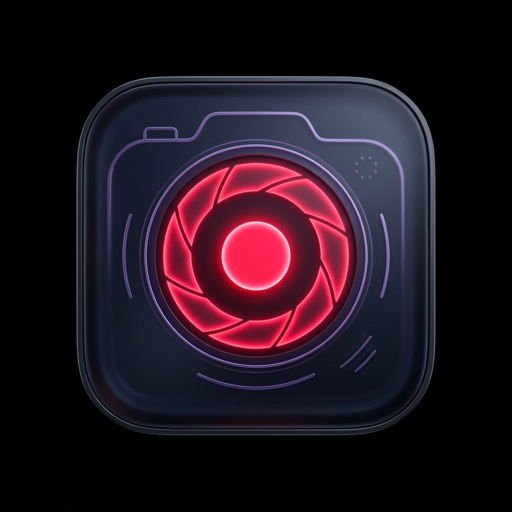

# 🎬 RecordIt Studio Pro

> **A sleek, lightweight, subscription-free macOS camera & audio recording studio with iPhone Continuity Camera support.**



---

## 💡 The Problem & Motivation

macOS natively lacks a simple, dedicated camera app for quickly recording video clips with your Mac webcam or wireless **iPhone Continuity Camera**. Existing App Store solutions are bloated, lock essential features behind monthly subscriptions, or add invasive watermarks.

**RecordIt Studio** was built to solve this exact problem: a fast, distraction-free, zero-subscription tool to capture crisp video and audio files instantly saved directly to your local drive for easy video editing.

---

## ✨ Features

- 📹 **Video + Audio & Audio-Only Modes**: Toggle between multi-source video capture and dedicated audio recording with a single click.
- 📱 **iPhone Continuity Camera Support**: Seamlessly use your iPhone camera wirelessly as your primary Mac camera input.
- 🎙️ **Mic Mode Enhancements**: Support for macOS audio processing profiles including **Voice Isolation** and **Wide Spectrum**.
- 🎛️ **Hardware Camera Effects**: Toggle native macOS video enhancements like Center Stage, Portrait Blur, and Studio Lighting.
- 📊 **Real-time Audio Spectrum Visualizer**: Dynamic 32-bar audio wave monitor for instant visual audio signal feedback.
- 📁 **Media Studio Library**: Built-in bento grid media manager to search, filter, preview, rename, reveal in Finder, or delete recordings.
- 💎 **Liquid Glass UI**: Ultra-modern 2026 Dark Glassmorphism interface with ambient backlighting and smooth micro-animations.
- 🔒 **100% Private & Local**: Zero cloud dependencies. All clips stay on your machine (`~/Movies/RecordIt` by default).

---

## 🛠️ Built With

- **Framework**: [Tauri v2](https://tauri.app/) (Rust backend)
- **Frontend**: HTML5, CSS3 (Liquid Dark Glass Design System), Modern Vanilla JS
- **APIs**: Native macOS AVFoundation & MediaCapture APIs

---

## 🚀 Quick Start

### Prerequisites
- macOS 14.0+ (Sonoma, Sequoia, or later)
- [Node.js](https://nodejs.org/) (v18+)
- [Rust toolchain](https://www.rust-lang.org/tools/install)

### Installation & Local Development

1. **Clone the repository:**
   ```bash
   git clone https://github.com/your-username/recordit.git
   cd recordit
   ```

2. **Install dependencies:**
   ```bash
   npm install
   ```

3. **Run in development mode:**
   ```bash
   npm run tauri:dev
   ```

4. **Build production app bundle:**
   ```bash
   npm run tauri:build
   ```

---

## 🍏 Installing to macOS Applications

To install the built `.app` to your `/Applications` directory and bypass macOS Gatekeeper unsigned application notices:

```bash
# 1. Copy bundle to Applications
rm -rf /Applications/RecordIt.app && cp -R src-tauri/target/release/bundle/macos/RecordIt.app /Applications/

# 2. Clear quarantine attribute
xattr -cr /Applications/RecordIt.app
```

---

## 📜 License

MIT License © 2026. Built with ❤️ for creators and indie developers.
